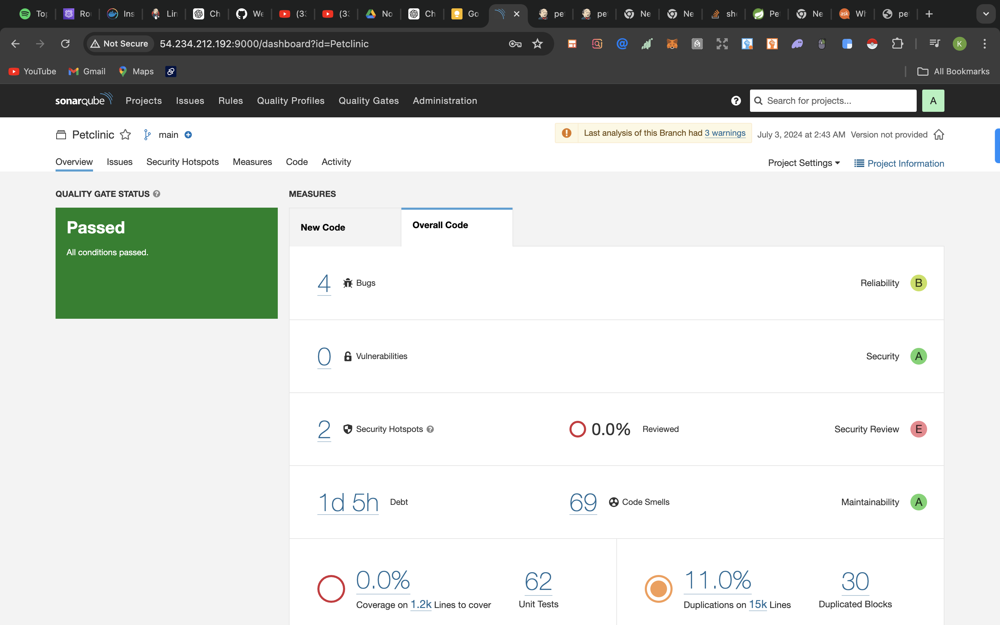
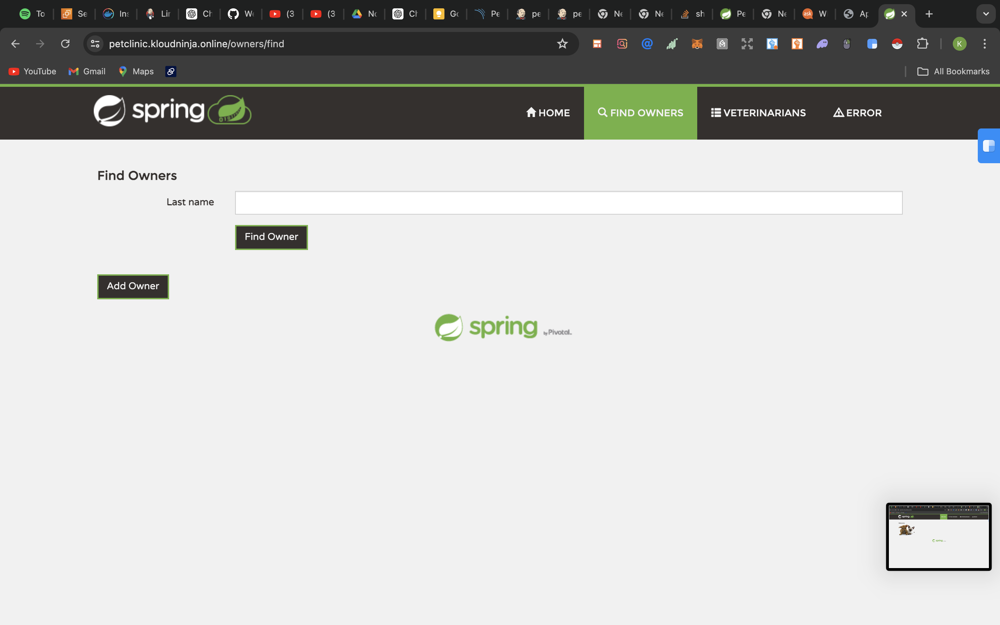
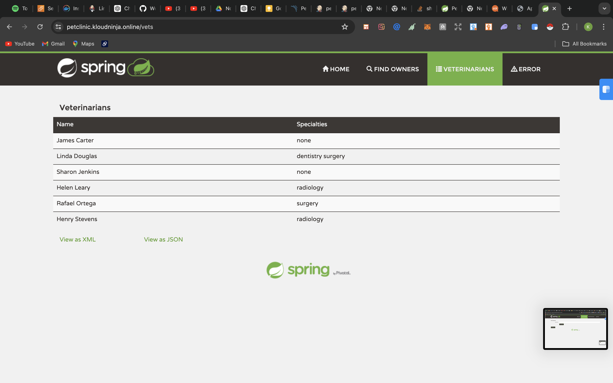

 
# Spring Boot Application Deployment to Tomcat  

This repository contains a Spring Boot application and the necessary instructions to deploy it to an Apache Tomcat server. The deployment process follows a DevOps approach involving continuous integration, containerization with Docker, deployment to Tomcat, and a feedback loop to drive iterative improvements.  


=======
# Spring PetClinic Sample Application  

[](https://github.com/spring-petclinic/spring-framework-petclinic/actions/workflows/maven-build.yml)
[](https://sonarcloud.io/dashboard?id=spring-petclinic_spring-framework-petclinic)
[](https://sonarcloud.io/dashboard?id=spring-petclinic_spring-framework-petclinic) 






## Table of Contents

- [Prerequisites](#prerequisites)
- [Getting Started](#getting-started)
- [Building the Application](#building-the-application)
- [Deploying to Tomcat](#deploying-to-tomcat)
- [Continuous Integration and Deployment](#continuous-integration-and-deployment)
- [Security and Quality Assurance](#security-and-quality-assurance)
- [Contributing](#contributing)

## Prerequisites

Before you begin, ensure you have the following installed on your local machine:

- [Java JDK 11](https://www.oracle.com/java/technologies/javase-jdk11-downloads.html)
- [Apache Maven](https://maven.apache.org/install.html)
- [Apache Tomcat 9](https://tomcat.apache.org/download-90.cgi)
- [Docker](https://www.docker.com/products/docker-desktop)
- [Git](https://git-scm.com/downloads)
- [SonarQube](https://www.sonarqube.org/downloads/)
- [Trivy](https://github.com/aquasecurity/trivy)
- [OWASP Dependency-Check](https://jeremylong.github.io/DependencyCheck/)

## Getting Started

1. **Clone the repository:**
    ```bash
    git clone https://github.com/Healerkay/Petclinic.git
    
    ```

2. **Set up Apache Tomcat:**
    - Download and extract [Apache Tomcat 9](https://tomcat.apache.org/download-90.cgi).
    - Set the `CATALINA_HOME` environment variable to the path of your Tomcat installation.

## Building the Application

1. **Build the Spring Boot application:**
    ```bash
    mvn clean install
    ```

2. **Locate the WAR file:**
    - The generated WAR file will be located in the `target` directory.

## Deploying to Tomcat

1. **Copy the WAR file to the Tomcat webapps directory:**
    ```bash
    cp target/your-application.war $CATALINA_HOME/webapps/
    ```

2. **Start Tomcat:**
    ```bash
    $CATALINA_HOME/bin/startup.sh
    ```

3. **Access the application:**
    - Open your browser and navigate to `http://localhost:8080/your-application`

## Continuous Integration and Deployment

To automate the build and deployment process, integrate with Jenkins:

1. **Set up Jenkins:**
    - Install Jenkins and required plugins (e.g., Git, Maven, Docker).

## Security and Quality Assurance

1. **Code Quality Analysis with SonarQube:**

2. **Dependency Vulnerability Check with OWASP Dependency-Check:**
  

3. **Container Vulnerability Scanning with Trivy:**

2. **Create a Jenkins Pipeline:**

2. **Implement a feedback loop:**
    - Use tools like Slack for real-time alerts and notifications to facilitate continuous improvement and rapid response to issues.

## Contributing

Contributions are welcome!

